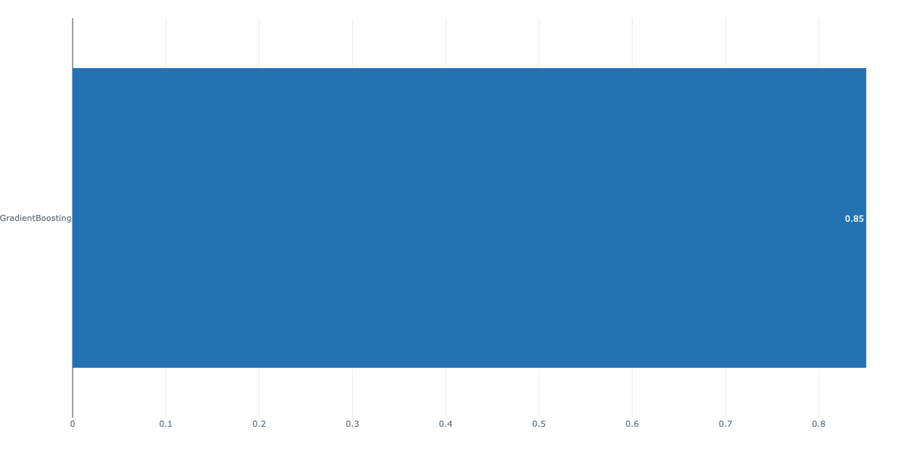
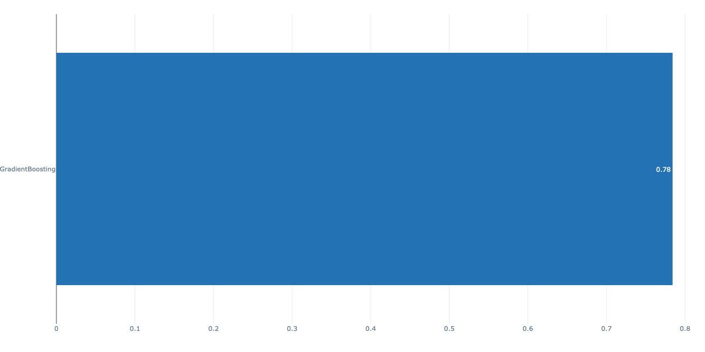
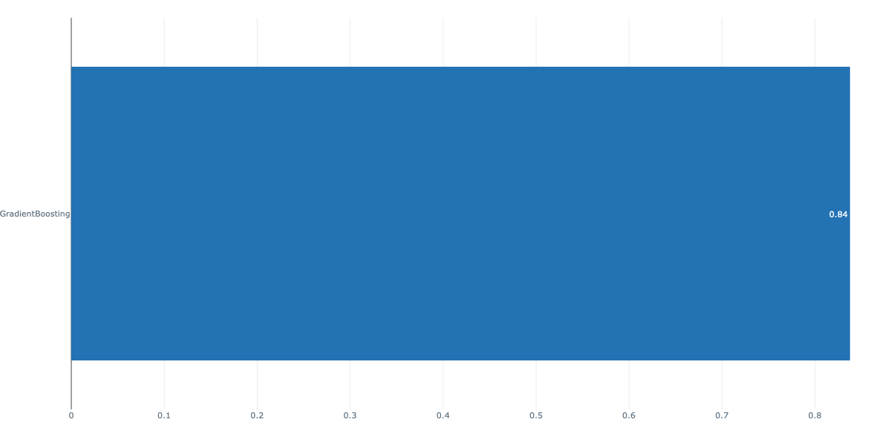
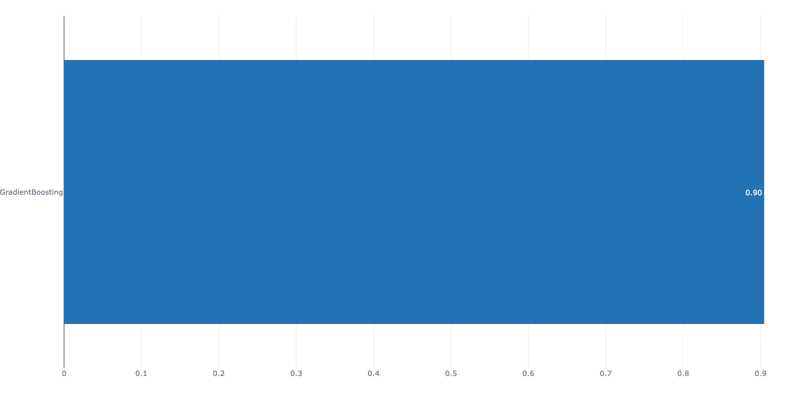
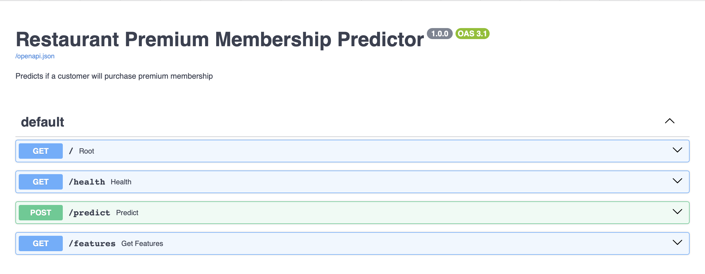
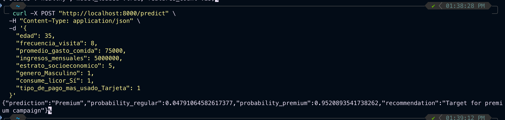

# MLOps Final Project - Restaurant Premium Membership Prediction

End-to-end MLOps project for predicting premium membership acquisition in restaurant customers using Google Cloud BigQuery data, MLflow experiment tracking, and Docker deployment.

## Project Overview

This project implements a complete machine learning pipeline to predict which restaurant customers are likely to purchase premium memberships. The solution includes data extraction, preprocessing with feature engineering, model training with experiment tracking, comprehensive evaluation, and API deployment.

**Target Variable:** Premium Membership (Binary Classification)  
**Optimization Metric:** Recall (to maximize customer capture for marketing campaigns)  
**Best Model:** Gradient Boosting (Recall: 0.89)

## Project Structure

```
mlops_final/
│
├── data/
│   ├── raw/                    # Original data from BigQuery 
│   └── processed/              # Cleaned and encoded data
│
├── notebooks/
│   └── exp.ipynb               # Exploratory data analysis
│
├── src/
│   ├── __init__.py             # Python package initializer
│   ├── download.py             # Download data from BigQuery
│   ├── preprocess.py           # Data cleaning and feature engineering
│   ├── train.py                # Model training with MLflow tracking
│   ├── evaluate.py             # Model evaluation (performance, consistency, scalability)
│   └── api.py                  # FastAPI prediction service
│
├── models/                     # Saved trained models
│   ├── best_model_GradientBoosting.pkl
│   └── evaluation/             # Evaluation results and plots
│
├── mlruns/                     # MLflow experiment tracking data
├── images/                     # Documentation images
│
├── master.py                   # Master pipeline orchestrator
├── requirements.txt            # Python dependencies
├── dockerfile                  # Docker container definition
├── jenkinsfile                 # CI/CD pipeline configuration
├── config.yaml                 # Configuration parameters
└── README.md
```

## Technology Stack

- **Data Source:** Google Cloud BigQuery
- **Language:** Python 3.10+
- **ML Framework:** scikit-learn
- **Experiment Tracking:** MLflow
- **API Framework:** FastAPI
- **Containerization:** Docker
- **Package Manager:** uv
- **CI/CD:** Jenkins (Phase 2)
- **Cloud Platform:** Google Cloud Platform / Vertex AI (Phase 3)

## Setup

### 1. Create virtual environment with uv:
```bash
# Install uv (if not already installed)
curl -LsSf https://astral.sh/uv/install.sh | sh

# Create and activate virtual environment
uv venv
source .venv/bin/activate
```

### 2. Install dependencies:
```bash
uv pip install -r requirements.txt
```

### 3. Configure GCP credentials:
```bash
export GOOGLE_APPLICATION_CREDENTIALS="path/to/credentials.json"
```

## Usage

### Run Complete Pipeline
```bash
python master.py
```

This executes the full workflow:
1. Data download from BigQuery
2. Preprocessing and feature engineering
3. Model training with MLflow tracking
4. Model evaluation and visualization

### Individual Steps
```bash
python src/download.py      # Download data from BigQuery
python src/preprocess.py    # Clean and engineer features
python src/train.py         # Train models
python src/evaluate.py      # Evaluate models
```

### View MLflow Experiment Results
```bash
mlflow ui
```
Open http://localhost:5000 to view experiment tracking dashboard.

## Data Pipeline

### Data Source
- **Source:** Google Cloud BigQuery
- **Table:** `pablo-cdp-ppp.proyecto_final_cdp.restaurante`
- **Records:** 30,000 customers
- **Features:** 17 columns (5 removed during preprocessing)

### Feature Engineering

The preprocessing pipeline (`src/preprocess.py`) implements the following transformations:

**1. Column Removal:**
- Removed non-predictive identifiers: `id_persona`, `nombre`, `apellido`, `telefono_contacto`, `correo_electronico`

**2. Missing Value Imputation:**
- Numerical variables: Median imputation
  - `edad` (101 missing, 0.34%)
  - `promedio_gasto_comida` (145 missing, 0.48%)
- Categorical variables: Mode imputation
  - `preferencias_alimenticias` (1,403 missing, 4.68%)
  - Contact information (50%+ missing, removed)

**3. Feature Encoding:**
- **Ordinal Encoding:** `estrato_socioeconomico` (preserves 1-6 order)
- **One-Hot Encoding:** All nominal categorical variables
  - `genero` (dichotomous)
  - `ciudad_residencia` (polytomous)
  - `ocio` (polytomous)
  - `consume_licor` (dichotomous)
  - `preferencias_alimenticias` (polytomous)
  - `membresia_premium` (target variable)
  - `tipo_de_pago_mas_usado` (polytomous)

**4. Final Features:**
- Input shape: 30,000 rows × 12 original features
- Output shape: 30,000 rows × ~50 features (after one-hot encoding)
- All features are numeric (ready for scikit-learn models)

## Model Training & Results

### Models Trained
Three classification models were trained and compared using MLflow:

1. **Logistic Regression** - Fast baseline model
2. **Random Forest** - Robust ensemble method
3. **Gradient Boosting** - Powerful sequential ensemble

### Model Selection Criteria
**Primary Metric:** Recall

**Business Justification:**
- Premium membership has high lifetime value (recurring revenue)
- Missing potential customers (False Negatives) = Lost revenue
- Digital marketing cost (False Positives) = Minimal cost
- Strategy: Maximize customer capture over precision

### Results


**Best Model: Gradient Boosting**
- **Recall:** 0.899(selected as best)
- **Accuracy:** 0.85
- **Precision:** 0.78
- **F1-Score:** 0.83
- **ROC-AUC:** 0.90

All metrics tracked and visualized in MLflow for reproducibility and comparison.

## Model Evaluation

Comprehensive evaluation across three dimensions:

### 1. Performance Metrics
- Accuracy, Precision, Recall, F1-Score, ROC-AUC
- Classification report and confusion matrix
- Probability calibration






### 2. Consistency (Cross-Validation)
- 5-fold cross-validation across all metrics
- Mean and standard deviation analysis
- Model stability assessment

### 3. Scalability
- Learning curves (training vs validation performance)
- Training time vs dataset size
- Prediction time analysis
- Suitable for production deployment

Results saved in `models/evaluation/` with visualizations and detailed metrics.

## API Deployment

### FastAPI Service

The model is deployed as a REST API using FastAPI:

```bash
# Run API locally
uvicorn src.api:app --reload

# Access interactive documentation
open http://localhost:8000/docs
```

### Docker Deployment

Build and run the containerized application:

```bash
# Build Docker image
docker build -t restaurant-ml-api .

# Run container
docker run -p 8000:8000 restaurant-ml-api

# Test API
curl http://localhost:8000/health
```



### API Endpoints

**GET /** - Root endpoint with API information  
**GET /health** - Health check and model status  
**GET /features** - List of required input features  
**POST /predict** - Make prediction for a customer

### Example Prediction Request

```bash
curl -X POST "http://localhost:8000/predict" \
  -H "Content-Type: application/json" \
  -d '{
    "edad": 35,
    "frecuencia_visita": 8,
    "promedio_gasto_comida": 75000,
    "ingresos_mensuales": 5000000,
    "estrato_socioeconomico": 5,
    "genero_Masculino": 1,
    "consume_licor_Sí": 1,
    "tipo_de_pago_mas_usado_Tarjeta": 1
  }'
```

**Response:**
```json
{
  "prediction": "Premium",
  "probability_regular": 0.047,
  "probability_premium": 0.952,
  "recommendation": "Target for premium campaign"
}
```



## Project Phases

### Phase 1: GitHub Repository (Complete)
- Data loading from Google Cloud BigQuery
- Exploratory data analysis with visualizations
- Feature engineering and preprocessing pipeline
- Model training with 3 algorithms
- MLflow experiment tracking and comparison
- Model evaluation (performance, consistency, scalability)
- FastAPI REST API implementation
- Docker containerization and deployment

### Phase 2: Jenkins CI/CD Pipeline
- Automated pipeline configuration
- Continuous integration and testing
- Build and deployment automation
- Notification system integration

### Phase 3: Google Cloud Vertex AI
- AutoML Tabular model training
- Custom Vertex AI pipelines
- Model deployment to cloud endpoints
- Performance comparison and monitoring
- Production-scale serving

## Key Features

- **Modular Architecture:** Clean separation of concerns with OOP principles
- **Experiment Tracking:** Complete MLflow integration for reproducibility
- **Production-Ready:** Dockerized API with comprehensive error handling
- **Scalable Design:** Easy to extend with new models or features
- **Documentation:** Interactive API docs with FastAPI
- **Version Control:** Git-based workflow with proper .gitignore

## Dependencies

See `requirements.txt` for complete list. Main dependencies:
- pandas, numpy - Data manipulation
- scikit-learn - Machine learning
- mlflow - Experiment tracking
- fastapi, uvicorn - API framework
- google-cloud-bigquery - Data source
- matplotlib, seaborn - Visualization
- joblib - Model serialization

## Contributing

This project follows clean code principles:
- No emojis in code or comments
- Minimal, necessary comments only
- Object-oriented design patterns
- Type hints where applicable
- Consistent naming conventions

## Author

Pablo Peralta  
Universidad Pontificia Bolivariana - MLOps Course

## License

Academic project for educational purposes.
